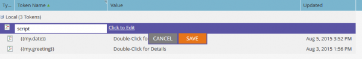

# Email Scripting

NOTE: It is highly recommended that you read the [Velocity User Guide](https://velocity.apache.org/engine/devel/user-guide.html) for a deep-dive into the behavior of the Velocity Template Language.

[Apache Velocity](https://velocity.apache.org/) is a language built on Java which is designed for templating and scripting HTML content. Marketo allows it to be used in the context of Emails by using scripting tokens. This gives access to data stored in Opportunities and Custom Objects, and allowing the creation of dynamic content in emails. Velocity offers standard high-level control flow with if/else, for, and for each to allow conditional and iterative manipulation of content. 

## Variables

Variables are always prefixed with '$' and are set and updated using #set:

```
#set($variable = "value")
```

Their values can then be retrieved via several different reference types with different behaviors:

```
$variable ##outputs 'value'
$variablename ##outputs '$variablename'
${variable}name ##outputs 'valuename'
```

There is also quiet reference notation, where there is a `!` Included after the `$`. Normally when velocity encounters an undefined reference, the string representing the reference is left in place. With quiet reference notation, if an undefined reference is encountered, then no value is emitted:

```
##Defined Reference

#set($foo = "bar")
$foo ##outputs "bar"

##Undefined Reference

##normal
$baz ##outputs "$baz"

##quiet
$!baz ##outputs nothing
```

For more information on how to reference variables, see the [Apache User Guide](https://velocity.apache.org/engine/devel/user-guide.html#formal-reference-notation).

## Velocity Tools

The Apache Velocity Project makes functionality available through the use of [Velocity Tools](https://velocity.apache.org/tools/devel/apidocs/overview-summary.html). These are simply wrappers for Java objects and expose their methods through global variables which are made available to all scripts.

- [AlternatorTool](https://velocity.apache.org/tools/devel/apidocs/org/apache/velocity/tools/generic/AlternatorTool.html)
- [ComparisonDateTool](https://velocity.apache.org/tools/devel/apidocs/org/apache/velocity/tools/generic/ComparisonDateTool.html)
- [ConversionTool](https://velocity.apache.org/tools/devel/apidocs/org/apache/velocity/tools/generic/ConversionTool.html)
- [DateTool](https://velocity.apache.org/tools/devel/apidocs/org/apache/velocity/tools/generic/DateTool.html)
- [DisplayTool](https://velocity.apache.org/tools/devel/apidocs/org/apache/velocity/tools/generic/DisplayTool.html)
- [MathTool](https://velocity.apache.org/tools/devel/apidocs/org/apache/velocity/tools/generic/MathTool.html)
- [NumberTool](https://velocity.apache.org/tools/devel/apidocs/org/apache/velocity/tools/generic/NumberTool.html)
- [EscapeTool](https://velocity.apache.org/tools/devel/apidocs/org/apache/velocity/tools/generic/EscapeTool.html)
- [LoopTool](https://velocity.apache.org/tools/devel/apidocs/org/apache/velocity/tools/generic/LoopTool.html)

For example, to use a method from `ComparisonDateTool`, access if from the `$date` variable in a script token:

```
#set($birthday = $convert.parseDate("2015-08-07","yyyy-MM-dd"))
##use whenIs to determine how many days away it is
$date.whenIs($birthday).days ##outputs 1
```

## Creating a Script Token

Velocity script is included in emails by using Email Scripting Tokens. These can be created in Marketing Activities in either a Marketing Folder or a Program. For a token to be used inside an email, the email must be a child of a program which either owns the token, or inherits it from a marketing folder. To create a token, navigate to a folder or program, and select the [!UICONTROL My Tokens] tab. From the right-hand menu drag the 'Email Script' option into the token list


From here, you can edit the name of the token, and open the editor via the [!UICONTROL Click to Edit] option:



Once you are in the editor, you can create a script with access to all variables in script-accessible objects. To get a field reference from an object, drag it from the right-hand tree into your script:


## Script Embedding and Testing

Once you have your script defined within a Program My Token, you can reference it within a given email using the Marketo email editor.


You can test your script using the [!UICONTROL Send Sample Email] email action within the Marketo email designer. For the script to process correctly, you must select an existing lead to impersonate in the [!UICONTROL Lead] field. If you're testing with `$TriggerObject`, you can select the triggering object via the [!UICONTROL Trigger] param. This uses the data from the most recently updated object of that type as the `$TriggerObject` variable.


You can also use the [!UICONTROL Email Preview] to test your script. To do so, you must select **[!UICONTROL View As: Lead Detail]**, and select a lead from an available static list. This has the added benefit of outputting any exceptions that may have occurred during script execution:


## Helpful Hints

The combined length of all Email Script Tokens in a given email may not exceed 100,000 bytes. This limit pertains to the total length of the token strings themselves (not the total length after tokens have been expanded).

- The variables referenced in the email script must exist in Marketo on one of the objects available to the script.
- You can reference first and second-level custom objects which originate from your natively integrated CRM that are directly connected to the Lead, or Contact, but not third-level custom objects. Custom Objects may not be parents of the Lead or Company
- For Marketo custom objects, you can reference second-level custom objects with Parent-Child relationship. For example `Lead <- Parent <- Child`. You cannot reference second-level custom objects with Edge-Bridge relationship. e.g.,  `Lead <- Bridge -> Edge`
- You can reference custom objects connected to a Lead, Contact, or an Account, but not more than one.
- Custom objects may only be referenced through a single connection, Lead, Contact, or Account
- You must check the box in the script editor for the fields you're using or they won't process
- For each custom object, the ten most recently updated records per person/contact are available at runtime and are ordered from most recently updated (at 0) to oldest updated (at 9). You can increase the number of records available by [following the instructions](https://experienceleague.adobe.com/en/docs/marketo/using/product-docs/administration/email-setup/change-custom-object-retrieval-limits-in-velocity-scripting).
- If you include more than one Email Script within an email, they execute top to bottom. The scope of variables defined in the first script to execute will be available in subsequent scripts.
- Tools Reference: [https://velocity.apache.org/tools/2.0/index.html](https://velocity.apache.org/tools/2.0/index.html)
- A note regarding tokens that contain newline characters "\\n" or "\\r\\n". When an email is sent via Send Sample or via a Batch Campaign, newline characters in tokens are replaced with spaces. When email is sent via Trigger Campaign, newline characters are left untouched.
- To ensure proper parsing of URLs, the whole path should be set as a variable and then printed, and variable should not be printed inside URL references. The protocol (http:// or https://) must be included and must be separate from the rest of the URL. The URL must also be part of a fully formed anchor (<a>) tag. The script must output a fully formed anchor tag, in order for links to be tracked. Links will not be tracked if they are outputted from within a for or foreach loop.

```html
<!-- Correct -->
#set($url = "www.example.com/${object.id}")
<a href="http://${url}">Link Text</a>

<!-- Correct -->
<a href="http://www.example.com/${object.id}">Link Text</a>

<!-- Incorrect -->
<a href="${url}">Link Text</a>

<!-- Incorrect -->
<a href="{{my.link}}">Link Text</a>

<!-- Incorrect -->
<a href="http://{{my.link}}">Link Text</a>
```
