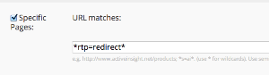

# Redirect

The RTP Redirect API allows you to redirect segmented audiences to a target URL.

- You must become a Web Personalization customer and have the [RTP tag deployed](https://experienceleague.adobe.com/en/docs/marketo/using/product-docs/web-personalization/rtp-tag-implementation/deploy-the-rtp-javascript) on your site prior to using the User Context API.
- RTP does not support Account Based Marketing named account lists. ABM lists and code only pertain to the uploaded account lists (CSV files) managed within RTP.

 

## Usage

`rtp('send' , 'redirect' , 'field_name' , [ 'values_array' , '...' , '...' ] , 'www.redirect_url.com' , true/false )`

| Parameter                 | Optional/Required | Type    | Description                 |
|---------------------------|-------------------|---------|-----------------------------|
| 'send'                    | Required          | String  | Method action.       |
| 'redirect'                | Required          | String  | Method name.             |
| field_name                | Required          | String  | Field name to match against. Example: 'abm.name' (see below).  |
| values_array              | Required          | Array   | List of values to match the field against (not case sensitive). |
| redirect_url              | Required          | String  | Target url to redirect visitors that matched the condition.    |
| redirect_matched_visitors | Optional          | Boolean | If true, condition matched visitors will be redirected. If false, condition unmatched visitors will be redirected. Default: true. |

Organization, Industry, ABM Lists, Location, ISP, Matched Segments

| Condition          | Data Hierarchy        | Example                   |
|-------------------------------------------------|----------------------|------------------------------------------------------------------------------------------------------------------|
| Matched Segments (Works only after first click) | matchedSegments.name | rtp( 'send', 'redirect' , 'matchedSegments.name' , ['Fortune 1,000' , 'Enterprise'] , 'http://www.marketo.com'); |
| Matched Segments (Works only after first click) | matchedSegments.id   | rtp( 'send', 'redirect' , 'matchedSegments.id' , [ 106 , 107 , 190 ] , 'http://www.marketo.com');                |
| ABM Lists          | abm.name             | rtp( 'send', 'redirect' , 'abm.name' , [ 'top_key_accounts', 'active_customers' ] , 'http://www.marketo.com');   |
| ABM Lists          | abm.code             | rtp( 'send', 'redirect' , 'abm.code' , [ 13 , 15 ] , 'http://www.marketo.com');     |
| Organizations      | org                  | rtp( 'send', 'redirect' , 'org', ['ebay'], 'http://www.marketo.com');               |
| Location           | location.country     | rtp( 'send', 'redirect' , 'location.country' , ['United States'], 'http://www.marketo.com');                     |
| Location           | location.state       | rtp( 'send', 'redirect' , 'location.state', ['ca'], 'http://www.marketo.com');      |
| Location           | location.city        | rtp( 'send', 'redirect' , 'location.city', ['San Mateo'], 'http://www.marketo.com');|
| Industries         | industries           | rtp( 'send', 'redirect' , 'industries' , ['Education'], 'http://www.marketo.com');  |
| ISP                | isp                  | rtp( 'send', 'redirect' , isp , ['False'], 'http://www.marketo.com');               |


## Notes

- If the redirect rule/condition is based on Firmographics (company, industry, location) you can insert the redirect code before the rtp('send', 'view') and the rtp('get','campaign') to reduce latency.
- Redirect via JavaScript is a browser side redirect and depends on the website's loading and optimization to reach maximum speed.
- The best practice is to set the redirect code right after the rtp tag and place it at the header.
- Make sure you're not running a self redirect (there is a safety net in rtp to block cyclic redirect calls).

```html
<!DOCTYPE html>
<html lang="en-US">
<head>
<!-- RTP tag --> 
<script type='text/javascript'>

// This tag needs to be replaced with your account tag
(function(c,h,a,f,i){c[a]=c[a]||function(){(c[a].q=c[a].q||[]).push(arguments)};
c[a].a=i;var g=h.createElement("script");g.async=true;g.type="text/javascript";
g.src=f+'?rh='+c.location.hostname+'&aid='+i;var b=h.getElementsByTagName("script")[0];b.parentNode.insertBefore(g,b);
})(window,document,"rtp","//xyz.marketo.com/rtp-api/v1/rtp.js","xyz");
 
// START REDIRECT EXAMPLE 
//   - Using a helper redirect function
//   - Redirect based on named account
rtp('send','redirect','org', ['microsoft'],'http://www.marketo.com');
 
// Redirect based on named account list (ABM)
rtp('send','redirect','abm.name', {
    // Redirect visitors that match 'first_abm' list to www.marketo.com
    'http://www.marketo.com' : ['first_abm'],
    // Redirect visitors that match 'second_abm' list to blog.marketo.com
    'http://blog.marketo.com' : ['second_abm'] 
});
// END REDIRECT EXAMPLE
rtp('send','view');
rtp('get','campaign');
</script>
<!-- End of RTP tag -->
```

## How to Redirect Tracked Visitors

1. Append a parameter to the end of the target URL: i.e. www.marketo.com?rtp=redirect
1. Create a segment called - "Redirected by RTP"
1. Use the 'Specific Pages' parameter to target visitors viewing any page with the parameter shown below.



## How to Define More Than One Condition with Different Target URLs

The redirect call supports multiple calls. This makes it possible to redirect with multiple fields and create complex conditions with different urls and values.

### Usage

`rtp('send', 'redirect', field_name, url_values_map);`

| Parameter | Optional/Required | Type | Description |
|---|---|---|---|
| 'send' | Required | String | Method action. |
| 'redirect' | Required | String | Method name. |
| field_name | Required | String | Field name to match against. Example: 'abm.name' (see above). |
| url_values_map | Required | Object | Map between redirect url and list of values. Example:{'http://marketo.com' : ['first_abm', 'second_abm']} |


#### Example

```javascript
rtp('send','redirect','abm.name', {
    // Redirect visitors that match 'first_abm' list to www.marketo.com
    'http://www.marketo.com' : ['first_abm'],
    // Redirect visitors that match 'second_abm' list to blog.marketo.com
    'http://blog.marketo.com' : ['second_abm']
});
rtp('send','redirect','org', {
    // Redirect visitors from 'Microsoft' to www.marketo.com/enterprise
    'http://www.marketo.com/enterprise' : ['microsoft']
});
```
