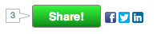

# Social

[Marketo Social Marketing](https://business.adobe.com/products/marketo/social-marketing.html) allows marketers to embed social widgets within websites and landing pages. Social widgets include polls, social share buttons, videos, sweepstakes, and promotions like referral offers.

## Sample Embedded Share Widget

```html
<!-- Marketo Widget Loader Script --> 

<script type="text/javascript" src="//b2c-mlm.marketo.com/jsloader/271d8232-1500-4305-b7ed-05d451b9ee0c/loader.php.js">
</script>

 <!-- The Location of the Social Widget --> 

<divclass='cf_widgetloader cf_w_245d8f3c0955454cbd26abc39d0d874c'="" options="{&quot;outerHeight&quot;:400, &quot;outerWidth&quot;:600}">
</divclass='cf_widgetloader'>
```



There are two basic methods for customization of a social widget:

1. Using the product's normal UI and attaching event listeners to be informed when certain actions have happened in the UI to perform additional business logic.
1. Replacing the product's normal UI with a custom one, and activating the popup "stages" of the UI when desired.

## Attaching Events to the Normal UI

There are two ways to subscribe to events in the CF JavaScript library, globally, or for a single widget. Events are documented below in the events table.

### Global Event Subscription

```html
<script>
cf_scripts.afterload(function(){
    CF.events.listen("event_name_here",
        function(event, arg1){
            //Your code to do something on the event goes here.
            //It will be fired whenever ANY widget fires the event "event_name_here".
        }
    );
});
</script>
```

### Per-Widget Event Subscription

```html
<script>
cf_scripts.afterload(function(){
    CF.widget.listen("widget_name_here", "event_name_here",
        function(event, arg1){
            //Your code to do something on the event goes here.
            //It will be fired whenever the widget named "widget_name_here" fires the event "event_name_here".
        }
    );
});
</script>
```

## An Example

This example shows a previously hidden element with id "signedUp" after a user has completed an offer enrollment for a widget named "referral_SignUp".

```html
<div id='signedUp'style='display:none; color:green;'>This is a custom message to let you know that you signed up!</div>
<div class='cf_widgetLoader cf_w_referral_SignUp'></div>

<script>
    cf_scripts.afterload(function(){
        CF.widget.listen("referral_SignUp", "offer_enrolled", function(){
        cf_jq("#signedUp").show();
    });
});
</script>
```

## Basic Events Table

| Event name| Description | Widgets that use this event | Supported Arguments (passed to event callback function) | 
| --- | --- | --- | --- | 
| share_sent | Fires every time a share request is sent to the server for processing | All widgets that have the ability to share | 1."share_sent" (String)<br>2. Parameters sent (Object) |
| share_success | Fires when the share request is successfully processed. | All widgets that have the ability to share. | 1."share_success" (String)<br>2. Share response object, containing message sent and shortened url (Object) | 
| vote_success | Fires when a user has successfully voted in a poll. | Poll, VS, Vote widgets | 1. "vote_success" (String)<br>2. Item voted for, including title, description, entity identifier (Object) | 
| offer_enrolled | Fires when a user has successfully enrolled in an offer | All offer widgets | 1."offer_enrolled" (String)<br>2. Changed user properties (Object),<br>3. Changed user attributes (Object) | 
| profile_saved | Fires when a user has updated their profile from profile capture | All non-offer widgets that have profile capture enabled | 1."profile_saved" (String)<br>2. Changed user properties (Object)<br>3. Changed user attributes (Object) | 
| video_loaded | Fires when an embedded video is fully loaded and initialized. | VideoShare widget | 1. "video_loaded" (String) 2. ".cf_videoshare_wrap" Element that holds the video (jQuery Object) |

## Replacing the UI with a Custom UI

To replace the UI with a custom UI, you must first turn off the normal UI, this is done by setting the option _popupUIOnly_ to _true_. With this option set, the standard UI will not render on page load, instead the widget fetches its data and wait for you to start one of its popup stages by calling the _CF.widget.activate_ function and providing options for what it should do.

Here is an example of creating a custom button that launches the referral offer sign-up flow for a referral offer widget named _referral_SignUp_.

```html
<button id="myNewSignUpButton">My newSign Up button</button>

<!-- Turn off the defaultreferral offer UI by setting popupUIOnly to true-->
<div class="cf_widgetLoader cf_w_referral_SignUp" options="{popupUIOnly:true}"></div>

<script>
cf_scripts.afterload(function($, CF){
    // After the cf script library has loaded, find the button with
    // id="myNewSignUpButton", and attach a click listener to it.
    $("#myNewSignUpButton").click(function(){
        // When it is clicked, activate the popup widget flow for the referral,
        // asking it to point to the clicked button.
        CF.widget.activate("referral_SignUp", {pointTo:$(this)});
    });
});
</script>
```

Because adding click handlers is common, there's a shortcut method for adding them. The following is functionally equivalent to the preceding example.

```html
<button id="myNewSignUpButton">My newSign Up button</button>
<div class="cf_widgetLoader cf_w_referral_SignUp" options="{popupUIOnly:true}"></div>

<script>
cf_scripts.afterload(function($, CF){
    // Use the addClickActivate convenience method, which will
    // automatically make the popup point at the clicked item with id myNewSignUpButton.
    CF.widget.addClickActivate("#myNewSignUpButton", "referral_SignUp", {});
});
</script>
```

## Getting Widget UI Data to Put Into Your Replacement UI

If you need data about the widget to draw your replacement UI, you can get the data from the special event _ui_data_. You can listen for this event with the normal `CF.widget.listen` function, but doing so can cause a potential race condition where your event listener is added after the widget has already fired the_ui_data_ event, thus you never receive data. To avoid this race, use the `CF.widget.uiData_ method instead, which will give you the most recent available _ui_data_, and listen for all future updates as well. The _ui_data` event is fired whenever there is an action taken that would have caused the widget's standard UI to be redrawn, even if you've disabled that ui with `popupUIOnly` option.

An example that uses `uiData` function to display the number of entries a user has for a sweepstakes with widget name _sweeps_Sweepstakes_.

```html
<span>You have <span id="entryCount">?</span> entries.</span>

<div class="cf_widgetLoader cf_w_sweeps_Sweepstakes"></div>

<button id='myNewSweepsButton'>New Sweeps Up Button!</button>

<script>
cf_scripts.afterload(function($, CF){
    CF.widget.uiData("sweeps_Sweepstakes", function(uiData){
        if(uiData.user && uiData.userStatus && uiData.userEntries){
            $("entryCount").html(""+ uiData.userEntries);
        }
        else{
            $("entryCount").html("0");
        }
    });
});
</script>
```

## Referral Offer SignUp UI Data Reference

| Type          | Description                                        |
|---------------|----------------------------------------------------|
| date          | Date value of the form "yyyy-MM-dd"                |
| number        | An integer or floating point number                |
| rich text     | An HTML string                                     |
| score         | A signed 32-bit integer                            |
| sfdc campaign | Used in Salesforce campaign management integration |
| text          | A text string                                      |

## Referral Offer TrackProgress UI Data Reference

| Type          | Description                                        |
|---------------|----------------------------------------------------|
| date          | Date value of the form "yyyy-MM-dd"                |
| number        | An integer or floating point number                |
| rich text     | An HTML string                                     |
| score         | A signed 32-bit integer                            |
| sfdc campaign | Used in Salesforce campaign management integration |
| text          | A text string                                      |

## Sweepstakes UI Data Reference (for Social Campaign Sweepstakes, not LM Sweepstakes)

| Type          | Description                                        |
|---------------|----------------------------------------------------|
| date          | Date value of the form "yyyy-MM-dd"                |
| number        | An integer or floating point number                |
| rich text     | An HTML string                                     |
| score         | A signed 32-bit integer                            |
| sfdc campaign | Used in Salesforce campaign management integration |
| text          | A text string                                      |

## Social Sign On (Form Fill Widget) Data Reference

| Type          | Description                                        |
|---------------|----------------------------------------------------|
| date          | Date value of the form "yyyy-MM-dd"                |
| number        | An integer or floating point number                |
| rich text     | An HTML string                                     |
| score         | A signed 32-bit integer                            |
| sfdc campaign | Used in Salesforce campaign management integration |
| text          | A text string                                      |

```javascript
{
"alt_id": "http://www.facebook.com/profile.php?id=1526228678",
"provider_name": "facebook",
"default_photo_url": "https://graph.facebook.com/1526228678/picture?type=large",
"email": "ian.b.taylor@gmail.com",
"verified_email": "ian.b.taylor@gmail.com",
"gender": "male",
"preferred_user_name": "IanTaylor",
"display_name": "Ian Taylor",
"birth_date": 343954800000,
"first_name": "Ian",
"last_name": "Taylor",
"city": null,
"state": null,
"region": null,
"postal_code": null,
"country": null,
"time_zone": null,
"connection_count": 0,
"credentials": {
"uid": "1526228678",
"scopes": "publish_actions",
"expires": "1371994082",
"accessToken": "BAAGFJ0KUFpcBABuNMptmYY...",
"type": "Facebook"
},
"about_me": null,
"cur_pos_title": "Senior Staff Engineer",
"phone_number": null,
"company": "Marketo",
"cur_pos_start_date": 1333231200000,
"cur_pos_summary": null
}
```
