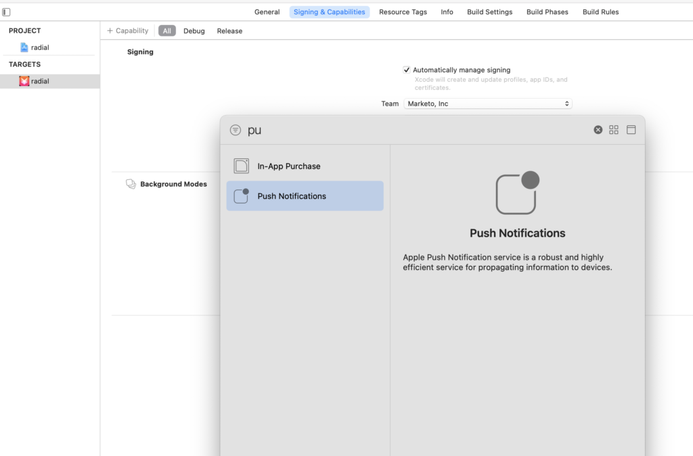
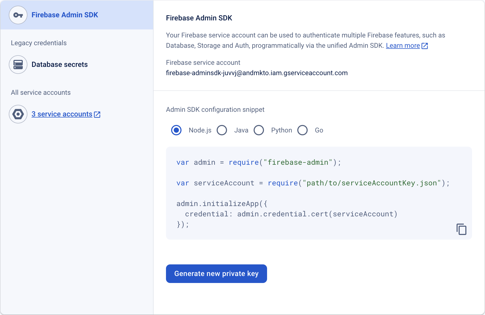

# Push Notifications

How to enable Push Notifications.

## Setup Push Notification on iOS

There are three steps to enable push notifications:

1. Configure push notifications on Apple Developer Account.
1. Enable push notifications in xCode.
1. Enable push notifications in app with Marketo SDK.

### Configure Push Notifications on Apple Developer Account

1. Log into the Apple Developer [Member Center](http://developer.apple.com/membercenter).
1. Click on "Certificates, Identifiers & Profiles".
1. Click on "Certificates->All" folder underneath "iOS, tvOS, watchOS".
1. Select the "+" on the top left screen next to certificates 
1. Enable "Apple Push Notification service SSL (Sandbox & Production)" checkbox, and click "Continue".
1. Select the application identifier that you are using the build the app.
1. Create and upload CSR to generate the push certificate. 
1. Download certificate to local computer and double-click to install. 
1. Open "Keychain Access", right click on the certificate, and export 2 items into the `.p12` file.
1. Upload this file through Marketo Admin Console to configure notifications.
1. Update app provisioning profiles.

### Enable Push Notifications in xCode

1. Turn on push notification capability in xCode project.

### Enable Push Notifications in App with Marketo SDK

Add the following code to `AppDelegate.m` file to deliver push notifications to your customer's devices.

**Note** - If using Adobe Launch extension, use **"ALMarketo"** as classname

1. Import following in `AppDelegate.h`.

>[!BEGINTABS]

>[!TAB Objective C]

```
#import <UserNotifications/UserNotifications.h>
```

>[!TAB Swift]

```
import UserNotifications
```

>[!ENDTABS]

1. Add `UNUserNotificationCenterDelegate` to `AppDelegate` as shown below.

>[!BEGINTABS]

>[!TAB Objective C]

```
@interface AppDelegate : UIResponder <UIApplicationDelegate, UNUserNotificationCenterDelegate>
```

>[!TAB Swift]

```
class AppDelegate: UIResponder, UIApplicationDelegate , UNUserNotificationCenterDelegate
```

>[!ENDTABS]

1. Initiate Push notification Service

To enable push notification add below code.

>[!BEGINTABS]

>[!TAB Objective C]

```objectivec
BOOL)application:(UIApplication *)application didFinishLaunchingWithOptions:(NSDictionary *)launchOptions {
  UNUserNotificationCenter *center = [UNUserNotificationCenter currentNotificationCenter];
        center.delegate = self;
        [center requestAuthorizationWithOptions:(UNAuthorizationOptionSound | UNAuthorizationOptionAlert | UNAuthorizationOptionBadge) completionHandler:^(BOOL granted, NSError * _Nullable error){
            if(!error){
                dispatch_async(dispatch_get_main_queue(), ^{
                    [[UIApplication sharedApplication] registerForRemoteNotifications];
                });
            }
        }];
   
    return YES;
}

```

>[!TAB Swift]

```
func application(_ application: UIApplication, didFinishLaunchingWithOptions launchOptions: [UIApplication.LaunchOptionsKey: Any]?) -> Bool {
              
     UNUserNotificationCenter.current().requestAuthorization(options: [.alert, .sound,    .badge]) { granted, error in
            if let error = error {
                print("\(error.localizedDescription)")
            } else {
                DispatchQueue.main.async {
                    application.registerForRemoteNotifications()
                }
            }
        }
        
        return true
 }
```

>[!ENDTABS]

Call this method to initiate the registration process with Apple Push Service. If registration succeeds, the app calls your App delegate object's `application:didRegisterForRemoteNotificationsWithDeviceToken:` method and passes it a device token.

If registration fails, the app calls its App delegate's `application:didFailToRegisterForRemoteNotificationsWithError:` method instead.

4 Register Push Token with Marketo

To receive push notifications from Marketo you must register the device token with Marketo.

>[!BEGINTABS]

>[!TAB Objective C]

```
- (void)application:(UIApplication *)application didRegisterForRemoteNotificationsWithDeviceToken:(NSData *)deviceToken {
    // Register the push token with Marketo
    [[Marketo sharedInstance] registerPushDeviceToken:deviceToken];
}
```

>[!TAB Swift]

```
func application(_ application: UIApplication, didRegisterForRemoteNotificationsWithDeviceToken deviceToken: Data) {
    // Register the push token with Marketo
    Marketo.sharedInstance().registerPushDeviceToken(deviceToken)
}
```

>[!ENDTABS]

The token can also be unregistered when user logs out.

>[!BEGINTABS]

>[!TAB Objective C]

```
[[Marketo sharedInstance] unregisterPushDeviceToken];
```

>[!TAB Swift]

```
Marketo.sharedInstance().unregisterPushDeviceToken
```

>[!ENDTABS]

Note To re-register the push token extract the code from step 3 into an AppDelegate method and call form the ViewController login method.

1. Handle push notification

To receive push notifications from Marketo you must register the device token with Marketo.

>[!BEGINTABS]

>[!TAB Objective C]

```
- (void)application:(UIApplication *)application didReceiveRemoteNotification:(NSDictionary *)userInfo
{
    [[Marketo sharedInstance] handlePushNotification:userInfo];
}
```

>[!TAB Swift]

```
func application(_ application: UIApplication, didReceiveRemoteNotification userInfo: [AnyHashable : Any]) {
    Marketo.sharedInstance().handlePushNotification(userInfo)
}

```

>[!ENDTABS]

1. Add the following method in AppDelegate

By using this method you can either present alert, sound or increase badge while the app is in foreground. You must call completionHandler of your choice in this Method.

>[!BEGINTABS]

>[!TAB Objective C]

```
-(void)userNotificationCenter:(UNUserNotificationCenter *)center
      willPresentNotification:(UNNotification *)notification
        withCompletionHandler:(void (^)(UNNotificationPresentationOptions options))completionHandler{

    completionHandler(UNAuthorizationOptionSound | UNAuthorizationOptionAlert | UNAuthorizationOptionBadge);
}
```

>[!TAB Swift]

```
func userNotificationCenter(_ center: UNUserNotificationCenter, 
            willPresent notification: UNNotification, withCompletionHandler completionHandler: @escaping (
    UNNotificationPresentationOptions) -> Void) {
       completionHandler([.alert, .sound,.badge])
}
```

>[!ENDTABS]

1. Handle newly received Push notification in AppDelegate

The method will be called on the delegate when the user responded to the notification by opening the application, dismissing the notification or choosing a UNNotificationAction. The delegate must be set before the application returns from applicationDidFinishLaunching:.

>[!BEGINTABS]

>[!TAB Objective C]

```
- (void)userNotificationCenter:(UNUserNotificationCenter *)center
didReceiveNotificationResponse:(UNNotificationResponse *)response withCompletionHandler:(void(^)(void))completionHandler {
    [[Marketo sharedInstance] userNotificationCenter:center didReceiveNotificationResponse:response withCompletionHandler:completionHandler];
}
```

>[!TAB Swift]

```
func userNotificationCenter(_ center: UNUserNotificationCenter,
                                didReceive response: UNNotificationResponse,
                                withCompletionHandler
                                completionHandler: @escaping () -> Void) {
        Marketo.sharedInstance().userNotificationCenter(center, didReceive: response, withCompletionHandler: completionHandler)
}
```

>[!ENDTABS]

1. Track push notifications

If your app is running in the background (or is not active), then the device will receive a push notification as shown below. Marketo will track when the user taps the notification.


If the device receives a push notification it will be passed to `application:didReceiveRemoteNotification:` callback on your App delegate.

The following is a Marketo activity log from Marketo that shows app events, and push notification events.


## Setup Push Notification on Android

1. Add following permission inside application tag.

Open `AndroidManifest.xml` and add following permissions. Your app must request the "INTERNET" and "ACCESS_NETWORK_STATE" permissions. If your app already requests these permissions, then skip this step.

```xml
<uses‐permission android:name="android.permission.INTERNET"/>
<uses‐permission android:name="android.permission.ACCESS_NETWORK_STATE"/>
   
<!‐‐Following permissions are required for push notification.‐‐>
<uses-permission android:name="android.permission.GET_ACCOUNTS"/>
<!‐‐Keeps the processor from sleeping when a message is received.‐‐>
<uses-permission android:name="android.permission.WAKE_LOCK"/>
<permission android:name="<PACKAGE_NAME>.permission.C2D_MESSAGE" android:protectionLevel="signature" />
<uses-permission android:name="<PACKAGE_NAME>.permission.C2D_MESSAGE" />
<!-- This app has permission to register and receive data message. -->
<uses-permission android:name="com.google.android.c2dm.permission.RECEIVE" />
```

1. Setting up FCM with HTTPv1 (Google has [deprecated XMPP protocol](https://firebase.google.com/docs/cloud-messaging/xmpp-server-ref) on 12th June, 2023 and will be removed in June 2024) 

- Enable MME FCM HTTPv1 in Marketo feature manager 
    - Upload Service Account Json file for the app in MLM.
    - You can download the Service Account Json file from Firebase Console.   
    - Wait for an hour after uploading Service Account Json file in Marketo before sending push notifications.  

## Android Test Devices

1. Add Marketo Activity in manifest file inside application tag.

```xml
<activity android:name="com.marketo.MarketoActivity"  android:configChanges="orientation|screenSize">
    <intent-filter android:label="MarketoActivity">
        <action  android:name="android.intent.action.VIEW"/>
        <category  android:name="android.intent.category.DEFAULT"/>
        <category  android:name="android.intent.category.BROWSABLE"/>
        <data android:host="add_test_device" android:scheme="mkto"/>
    </intent-filter/>
</activity/>

```

## Register Marketo Push Service

1. To receive push notifications from Marketo, you must add the Firebase messaging service to your `AndroidManifest.xml`. Add before the closing application tag.

```xml
<meta-data
      android:name="com.google.android.gms.version"
      android:value="@integer/google_play_services_version" />
<service android:name=".MyFirebaseMessagingService">
  <intent-filter>
  <action android:name="com.google.firebase.INSTANCE_ID_EVENT"/>
  <action android:name="com.google.firebase.MESSAGING_EVENT"/>
  </intent-filter>
</service>
```

Add Marketo SDK methods in the file `MyFirebaseMessagingService` as follows

```java
import com.marketo.Marketo;

public class MyFirebaseMessagingService extends FirebaseMessagingService {

    @Override
    public void onNewToken(String s) {
        super.onNewToken(s);
        Marketo marketoSdk = Marketo.getInstance(this.getApplicationContext());
        marketoSdk.setPushNotificaitonToken(s);
        // Add your code here...
    }

    @Override
    public void onMessageReceived(RemoteMessage remoteMessage) {
        Marketo marketoSdk = Marketo.getInstance(this.getApplicationContext());
        marketoSdk.showPushNotificaiton(remoteMessage);
        // Add your code here...
    }

}
```

**Note** - If using Adobe extension, add as below

```java
import com.marketo.Marketo;

public class MyFirebaseMessagingService extends FirebaseMessagingService {

    @Override
    public void onNewToken(String token) {
        super.onNewToken(token);
        ALMarketo.setPushNotificationToken(token);
        // Add your code here...
    }

    @Override
    public void onMessageReceived(RemoteMessage remoteMessage) {
        ALMarketo.showPushNotification(remoteMessage);
        // Add your code here...
    }

}
```

**NOTE**: The FCM SDK automatically adds all required permissions as well as the required receiver functionality. Make sure to remove the following obsolete (and potentially harmful, as they may cause message duplication) elements from your app's manifest if you used previous versions of SDK

```xml
<receiver android:name="com.marketo.MarketoBroadcastReceiver" android:permission="com.google.android.c2dm.permission.SEND">
    <intent-filter>
        <!‐‐Receives the actual messages.‐‐>
        <action android:name="com.google.android.c2dm.intent.RECEIVE"/>
        <!‐‐Register to enable push notification‐‐>
        <action android:name="com.google.android.c2dm.intent.REGISTRATION"/>
        <!‐‐‐Replace YOUR_PACKAGE_NAME with your own package name‐‐>
        <category android:name="YOUR_PACKAGE_NAME"/>
    </intent-filter>
</receiver>

<!‐‐Marketo service to handle push registration and notification‐‐>
<service android:name="com.marketo.MarketoIntentService"/>
```

1. Initialize Marketo Push After saving the configuration above, you must initialize Marketo Push Notification. Create or open your Application class and copy/paste the code below. You can get your sender ID from the Firebase console.


```java
Marketo marketoSdk = Marketo.getInstance(getApplicationContext());

// Enable push notification here. The push notification channel name can by any string
marketoSdk.initializeMarketoPush(SENDER_ID,"ChannelName");
```

If using Adobe Launch Extension, use these instructions

```java
// Enable push notification here. The push notification channel name can by any string
ALMarketo.initializeMarketoPush(SENDER_ID,"ChannelName");
```

If you do not have a SENDER_ID, then enable Google Cloud Messaging Service by completing the steps detailed in [this tutorial](https://developers.google.com/cloud-messaging/).

The token can also be unregistered when user logs out.

```java
marketoSdk.uninitializeMarketoPush();
```

If using Adobe Launch extension, use the instruction below

```java
ALMarketo.uninitializeMarketoPush();
```

Note: To re-register the push token extract the code from step 3 into an AppDelegate method and call form the ViewController login method.

1. Set Notification Icon (Optional) To configure a custom notification icon the following method should be called.

```java
MarketoConfig.Notification config = new MarketoConfig.Notification();
// Optional bitmap for honeycomb and above
config.setNotificationLargeIcon(bitmap);

// Required icon Resource ID
config.setNotificationSmallIcon(R.drawable.notification_small_icon); 

// Set the configuration 
//Use the static methods on ALMarketo class when using Adobe Extension
Marketo.getInstance(context).setNotificationConfig(config); 

// Get the configuration set 
Marketo.getInstance(context).getNotificationConfig();
```

## Troubleshooting

Setting up mobile push messages involves many steps and the coordination of developers and marketers. If you are experiencing difficulties, there are some simple things that you can check.

After you ensure that the simple things are correct, then you can dig deeper into the programming details.

### Push Message is Not Showing Up

First, check to see if push messages are disabled on the handset. Mobile users can control whether or not they receive messages for any particular app. Often developers (and marketers) will disable these messages at some point during development. So the first thing to check is whether the recipient has disabled push messages for your app.

Second, is the app already open and active on the device? When your app is the active app on the device, mobile push messages do not pop up on the screen. Instead, they appear in the "local notifications" area of your app.

### View the Activity Logs in Marketo

The first place to look when tracking down an error is in the Marketo Activity logs. You can use activity logs to verify that a message was sent.

In the activity log, look at the activity records for a person that was supposed to receive a message. If the message was sent, there will be a record present in the activity log. If not, the problem is likely due to the configuration of the iOS certificate or Android API key within Marketo.

### Certificate or Key is Invalid

Double check your configuration to make sure that you have the proper certificate loaded for Sandbox or Production. Sometimes it is best to have the developer re-export the certificates (iOS) or keys (Android) and then reload them into Marketo to ensure that they are correct.

### .p12 file is Missing a Certificate or Key (iOS)

When you export the certificate, make sure that you export the key _and_ the certificate.

### Provisioning Profiles Out-of-Date (iOS)

Whenever you add a new device, you must update your provisioning profiles and generate new certificates. Make sure that your Xcode project then points to the correct profiles and certificates, and import those certificates into Marketo.

### Cannot Upload iOS Certificate (IOS)

Ensure that the password used while exporting the certificate does not contain an spaces.  For example, instead of this:

`Hello World 123`

use this:

`HelloWorld123`

### Troubleshooting iOS Certificates

For sandbox applications, you can use either a "developer" or "universal" certificate. But for production applications you must upload a valid "distribution" or "universal" certificate.

### Push Bounce / Invalid Token

An existing registration token may cease to be valid in a number of scenarios, including:

- If the client app un-registers with GCM.
- If the client app is automatically unregistered, which can happen if the user uninstalls the application. For example, on iOS, if the APNS Feedback Service reported the APNS token as invalid.
- If the registration token expires. For example, Google might decide to refresh registration tokens, or the APNS token has expired for iOS devices.
- If the client app is updated but the new version is not configured to receive messages.
