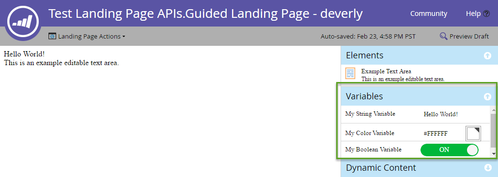

[Landing Page Endpoint Reference](https://developer.adobe.com/marketo-apis/api/asset/#tag/Landing-Pages)

Landing Pages are web pages hosted by Marketo.

## Query

Note: A member 'url' was erroneously added to the Landing Page response in August 2020. This member will be removed in the October 2020 release and should not be used. 'URL' is the correct member

Like most other assets, Landing Pages can be queried [by name](https://developer.adobe.com/marketo-apis/api/asset/#tag/Landing-Pages/operation/getLandingPageByNameUsingGET), [by id](https://developer.adobe.com/marketo-apis/api/asset/#tag/Landing-Pages/operation/getLandingPageByIdUsingGET), and by [browsing](https://developer.adobe.com/marketo-apis/api/asset/#tag/Landing-Pages/operation/browseLandingPagesUsingGET). These queries will only return metadata, and the list of content sections for a landing page must be queried separately by the id of the landing page.

Querying the content of the landing page will return a list of content sections available in the landing page. A section must be present in the content list of a page in order to update the content:

```
GET /rest/asset/v1/landingPage/{id}/content.json
```

```json
{
    "success": true,
    "warnings": [],
    "errors": [],
    "requestId": "6307#154ea1689d7",
    "result": [
        {
            "id": "67",
            "type": "Form",
            "index": 1,
            "content": {
                "content": "189",
                "contentType": "Form",
                "contentUrl": "https://app-devlocal1.marketo.com/#FO189A1ZN13LA1"
            },
            "formattingOptions": {
                "zIndex": 15,
                "left": "359px",
                "top": "122px"
            }
        }
    ]
}
```

Results will differ between guided and free form templates, as guided landing pages come with a set of sections which are defined by the template from which they are derived, while free form pages do not come with predefined sections, and their content must be added prior to editing.  Note that the format of the "content" attribute can vary depending on the "type" attribute, and wether the field is static or dynamic.

## Create and Update

[Landing pages are created](https://developer.adobe.com/marketo-apis/api/asset/#tag/Landing-Pages/operation/createLandingPageUsingPOST) by referencing back to a template. The only required fields for creation are name, template (the id of the template), and the folder to place the page in. For additional metadata that can be populated, see the endpoint reference.

Valid content types for [landing page content](https://developer.adobe.com/marketo-apis/api/asset/#tag/Landing-Page-Content) endpoints are: richText, HTML, Form, Image, Rectangle, Snippet.

```
POST rest/asset/v1/landingPages.json
```

```
Content-Type: application/x-www-form-urlencoded
```

```
name=createLandingPage&folder={"type": "Folder", "id": 11}&template=1&description=this is a test&workspace=default&title=test create&keywords=awesome&formPrefill=false
```

```json
{
    "success": true,
    "warnings": [],
    "errors": [],
    "requestId": "7a39#154cf7922c6",
    "result": [
        {
            "id": 27,
            "name": "createLandingPage",
            "description": "this is a test",
            "createdAt": "2016-05-20T18:41:43Z+0000",
            "updatedAt": "2016-05-20T18:41:43Z+0000",
            "folder": {
                "type": "Folder",
                "value": 11,
                "folderName": "Landing Pages"
            },
            "workspace": "Default",
            "status": "draft",
            "template": 1,
            "title": "test create",
            "keywords": "awesome",
            "robots": "index, nofollow",
            "formPrefill": false,
            "mobileEnabled": false,
            "URL": "https://app-devlocal1.marketo.com/lp/622-LME-718/createLandingPage.html",
            "computedUrl": "https://app-devlocal1.marketo.com/#LP27B2"
        }
    ]
}
```

Landing page metadata can be updated with the [Update Landing Page Metadata endpoint](https://developer.adobe.com/marketo-apis/api/asset/#tag/Landing-Pages/operation/updateLandingPageUsingPOST).

## Approval

Landing Pages follow the standard draft-approved model, where there can be a draft version and/or an approved version. Whenever updates are applied to a page, they are always applied to the draft version first, and will only be seen live when the page has been approved.

## Delete

To delete a landing page, it must first be out of use and not referenced by any other Marketo assets, as well as be unapproved. Pages are deleted individually with the [Delete Landing Page](https://developer.adobe.com/marketo-apis/api/asset/#tag/Landing-Pages/operation/deleteLandingPageByIdUsingPOST) endpoint. Landing pages with embedded social buttons cannot be deleted through this API. 

## Clone

Marketo provides a simple method for cloning a Landing Page. This is an application/x-www-url-formencoded POST request.

The `id` path parameter specifies the id of the source Landing Page to clone.

The `name` parameter is used to specify the name of the new Landing Page.

The `folder` parameter is used to specify the parent folder where new Landing Page is created. This is in the form of an embedded JSON object containing `id` and `type`.

The `template` parameter is used to specify the source Landing Page Template id.

The optional `description` parameter is used to describe the new Landing Page.

```
POST /rest/asset/v1/landingPage/{id}/clone.json
```

```
Content-Type: application/x-www-form-urlencoded
```

```
name=MyNewLandingPage&folder={"type":"Program","id":1119}&template=57
```

```json
{
    "success": true,
    "errors": [],
    "requestId": "1078d#1683e4881c6",
    "warnings": [],
    "result": [
        {
            "id": 3291,
            "name": "MyNewLandingPage",
            "createdAt": "2019-01-11T18:59:25Z+0000",
            "updatedAt": "2019-01-11T18:59:25Z+0000",
            "folder": {
                "type": "Program",
                "value": 1119,
                "folderName": "DefaultProgramWithGuidedLP"
            },
            "workspace": "Default",
            "status": "draft",
            "template": 57,
            "robots": "index, nofollow",
            "formPrefill": false,
            "mobileEnabled": false,
            "URL": "http://na-abm.marketo.com/lp/284-RPR-133/DefaultProgramWithGuidedLPPerkutoTestLP-Clone-1.html",
            "computedUrl": "https://app-abm.marketo.com/#LP3291A1LA1"
        }
    ]
}
```

## Manage Content Section

Content sections are ordered by their index property, and ultimately laid out according to whatever CSS rules are applied when displayed by the client. Content sections are included and managed with the corresponding [Add](https://developer.adobe.com/marketo-apis/api/asset/#tag/Landing-Page-Content/operation/addLandingPageContentUsingPOST), [Update](https://developer.adobe.com/marketo-apis/api/asset/#tag/Landing-Page-Content/operation/updateLandingPageContentUsingPOST) and [Delete](https://developer.adobe.com/marketo-apis/api/asset/#tag/Landing-Page-Content/operation/removeLandingPageContentUsingPOST) Landing Page content section endpoints, and can be queried using [Get Landing Page Content](https://developer.adobe.com/marketo-apis/api/asset/#tag/Landing-Page-Content/operation/getLandingPageContentUsingGET). Each section has a type and a value parameter. The type determines what should be put into the value.  For these endpoints, data is passed as POST x-www-form-urlencoded, not as JSON.

**Section Types**

|Type|Value|
|--- |--- |
|DynamicContent|The id of the segmentation.|
|Form|The id of the form.|
|HTML|Text HTML content.|
|Image|The id of the image asset.|
|Rectangle|Empty.|
|RichText|Text HTML content.  May only contain rich text elements.|
|Snippet|The id of the snippet.|
|SocialButton|The id of  the social button.|
|Video|The id of the video.|

For free form pages, all desired content sections must be added and will be embedded in the div element with the id `mktoContent`. For guided pages, a list of predefined elements may be present in the list from [Get Landing Page Content](https://developer.adobe.com/marketo-apis/api/asset/#tag/Landing-Page-Content/operation/getLandingPageContentUsingGET) endpoint. More can be added or their [content updated](https://developer.adobe.com/marketo-apis/api/asset/#tag/Landing-Page-Content/operation/updateLandingPageContentUsingPOST) via their respective endpoints.

### Dynamic Content

To make a Dynamic Content section, it must already be present in the landing page's content list. The [Update Landing Page Content Section](https://developer.adobe.com/marketo-apis/api/asset/#tag/Landing-Page-Content/operation/updateLandingPageContentUsingPOST) endpoint then needs to be used to set the type to 'DynamicContent'. When a section is set to dynamic content, it creates underlying dynamic sections within the content section which all inherit the base type of the converted element. Each dynamic section also inherits the content from the converted section.

```
GET /rest/asset/v1/landingPage/{id}/dynamicContent/RVMtNDg=.json
```

```json
{
  "success": true,
  "warnings": [],
  "errors": [],
  "requestId": "46e#1560fa169d9",
  "result": [
    {
      "createdAt": "2016-07-21",
      "updatedAt": "2016-07-21",
      "segmentation": 1007,
      "segments": [
        {
          "segmentId": 1018,
          "segmentName": "Default",
          "type": "RichText",
          "content": "\n\t\t\t\t\t\t\tAlice was beginning to get very tired of sitting by her sister on the bank, and having nothing to do: once or twice she had peeped into the book her sister was reading, but it had no pictures or conversations in it.\n\t\t\t\t\t\t"
        },
        {
          "segmentId": 1017,
          "segmentName": "New Segment",
          "type": "RichText",
          "content": "\n\t\t\t\t\t\t\tAlice was beginning to get very tired of sitting by her sister on the bank, and having nothing to do: once or twice she had peeped into the book her sister was reading, but it had no pictures or conversations in it.\n\t\t\t\t\t\t"
        }
      ]
    }
  ]
}
```

[Updating the content](https://developer.adobe.com/marketo-apis/api/asset/#tag/Landing-Page-Content/operation/updateLandingPageDynamicContentUsingPOST) for each individual segment is done on the basis of the segment id.

```
POST /rest/asset/v1/landingPage/{id}/dynamicContent/{dynamicContentId}.json
```

```
Content-Type: application/x-www-form-urlencoded
```

```
segment=New Segment&value=New Content
```

```json
 {
  "success": true,
  "warnings": [],
  "errors": [],
  "requestId": "7516#14e08fe7cbbc",
  "result": [
    {
      "id": 1012
    }
  ]
}
```

## Variables

One of the features introduced in guided landing pages is editable variables.  Variables contain values for elements on a landing page.  Variables can easily be modified using the landing page editor as shown below:



Variables are defined as meta tags inside `<head>` element of a guided mode landing page template. There are three types of variables available: String, Color and Boolean.  Here is an example of three variable definitions:

```html
<head>
  <meta charset="utf-8">
  <meta class="mktoString" mktoName="My String Variable" id="stringVar" default="Hello World!">
  <meta class="mktoColor" mktoName="My Color Variable" id="colorVar" default="#ffffff">
  <meta class="mktoBoolean" mktoName="My Boolean Variable" id="boolVar" default="true">
</head>
```

For more information see "Editable Variable" section in [Create a Guided Landing Page Template](https://experienceleague.adobe.com/en/docs/marketo/using/product-docs/demand-generation/landing-pages/landing-page-templates/create-a-guided-landing-page-template) documentation.

#### Query

Retrieve variables for a guided landing page by passing the landing page id to Get Landing Page Variables endpoint.

```
GET /rest/asset/v1/landingPage/{id}/variables.json
```

```json
{
    "success": true,
    "warnings": [],
    "errors": [],
    "requestId": "10843#15a6d7e5fa1",
    "result": [
        {
            "id": "stringVar",
            "value": "Hello World!",
            "type": "string"
        },
        {
            "id": "colorVar",
            "value": "#FFFFFF",
            "type": "color"
        },
        {
            "id": "boolVar",
            "value": "true",
            "type": "boolean"
        }
    ]
}
```

In  this example, the guided landing page contains 3 variables: stringVar, colorVar, boolVar.

#### Update

Update a variable for a guided landing page by passing the landing page id, the variable id, and the variable value to Update Landing Page Variables endpoint.

```
POST /rest/asset/v1/landingPage/{id}/variable/{variableId}.json?value={newValue}
```

```json
{
    "success": true,
    "warnings": [],
    "errors": [],
    "requestId": "2b07#15a6db77da3",
    "result": [
        {
            "id": "stringVar",
            "value": "Hello Brave New World!",
            "type": "String"
        }
    ]
}
```

## Preview Landing Page

Marketo provides the [Get Landing Page Full Content](https://developer.adobe.com/marketo-apis/api/asset/#tag/Landing-Pages/operation/getLandingPageFullContentUsingGET) endpoint to retrieve a live preview of a landing page as it would be rendered in a browser. There is one required parameter, the `id` path parameter which is the id of the landing page that you wish to preview. There are two additional optional query parameters:

- segmentation: Accepts an array of JSON objects that contain segmentationId and segmentId attributes. When set, previews the landing page as though you were a lead matching those segments.
- leadId:  Accepts the integer id of a lead. When set, previews the landing page as though it were viewed by the designated lead.

```
GET /rest/asset/v1/landingPage/{id}/fullContent.json?leadId=1001&segmentation=[{"segmentationId":1030,"segmentId":1103}]
```

```json
{
  "success": true,
  "errors": [],
  "requestId": "119ab#17692849f1e",
  "warnings": [],
  "result": [
    {
      "id": 1023,
      "content": "<!DOCTYPE html>\n<html>\n <head>\n <meta charset=\"utf-8\">\n \n \n <meta name=\"robots\" content=\"index, nofollow\">\n <title></title>\n <style>\n body {background:#FFFFFF} \n #myConditionalDisplayArea {\n display: true;\n }\n </style>\n <link rel=\"shortcut icon\" href=\"/favicon.ico\" type=\"image/x-icon\" >\n<link rel=\"icon\" href=\"/favicon.ico\" type=\"image/x-icon\" >\n\n\n<style>.mktoGen.mktoImg {display:inline-block; line-height:0;}</style>\n </head>\n <body id=\"bodyId\">\n \n Hello Brave New World!\n <div class=\"mktoText\" id=\"exampleText\"><div>This is an example editable text area.</div>\n<div>Lead Full Name = Hanna Crawford</div>\n<div><br /></div>\n <script type=\"text/javascript\" src=\"//munchkin.marketo.net//munchkin.js\"></script><script>Munchkin.init('123-ABC-456', {customName: 'Test-Landing-Page-APIs_Guided-Landing-Page---deverly', PURL_VISIT_TOKEN, wsInfo: 'j1RR'});</script>\n<div id=\"mktoClickBlockingDiv\"></div>\n </body>\n</html>\n"
    }
  ]
}
```
