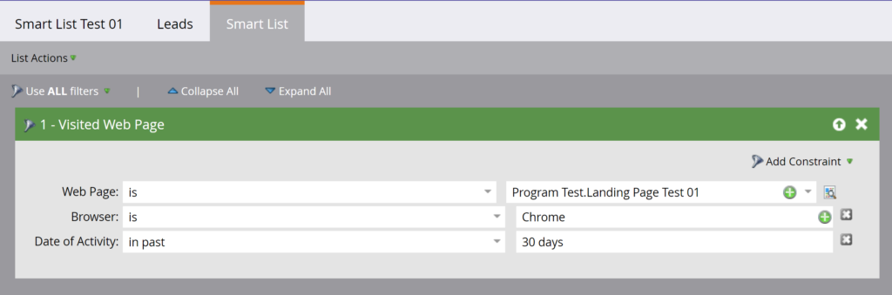

# Smart Lists

[Smart Lists Endpoint Reference](https://developer.adobe.com/marketo-apis/api/asset/#tag/Smart-Lists)

Marketo offers a set of REST APIs for performing operations on smart lists. These APIs follow the standard interface pattern for asset APIs providing Query, Delete, and Clone options.

Note: These APIs are supported for user-created Smart Lists only. They cannot be used for [Built-in/System Smart Lists](https://experienceleague.adobe.com/en/docs/marketo/using/product-docs/core-marketo-concepts/smart-lists-and-static-lists/using-smart-lists/use-built-in-system-smart-lists).

## Query

Querying smart lists follows the standard query types for assets of [by id](https://developer.adobe.com/marketo-apis/api/asset/#tag/Smart-Lists/operation/getSmartListByIdUsingGET), [by name](https://developer.adobe.com/marketo-apis/api/asset/#tag/Smart-Lists/operation/getSmartListByNameUsingGET), and [browse](https://developer.adobe.com/marketo-apis/api/asset/#tag/Smart-Lists/operation/getSmartListsUsingGET ).

### By Id

[Query by id]https://developer.adobe.com/marketo-apis/api/asset/#tag/Smart-Lists/operation/getSmartListByIdUsingGET) takes a single smart list `id` as a path parameter and returns a single smart list record. Optionally you may pass the `includeRules` boolean parameter to include smart list rules in the response.



```
GET /rest/asset/v1/smartList/{id}.json?includeRules=true
```

```json
{
    "success": true,
    "errors": [],
    "requestId": "6efc#16c8967a21f",
    "warnings": [],
    "result": [
        {
            "id": 4363,
            "name": "Smart List Test 01",
            "createdAt": "2019-06-03T23:01:13Z+0000",
            "updatedAt": "2019-06-04T17:37:45Z+0000",
            "url": "https://app-sjqe.marketo.com/#SL4363A1LA1",
            "folder": {
                "id": 1041,
                "type": "Program"
            },
            "workspace": "Default",
            "rules": {
                "filterMatchType": "all",
                "triggers": [],
                "filters": [
                    {
                        "id": 459,
                        "name": "Visited Web Page",
                        "ruleTypeId": 1,
                        "ruleType": "Activity",
                        "operator": "occurs",
                        "conditions": [
                            {
                                "activityAttributeId": 1,
                                "activityAttributeName": "Web Page",
                                "operator": "is",
                                "values": [
                                    "Program Test.Landing Page Test 01"
                                ],
                                "isPrimary": true
                            },
                            {
                                "activityAttributeId": 6,
                                "activityAttributeName": "Browser",
                                "operator": "is",
                                "values": [
                                    "Chrome"
                                ],
                                "isPrimary": false
                            },
                            {
                                "activityAttributeId": -101,
                                "activityAttributeName": "Date of Activity",
                                "operator": "in past",
                                "values": [
                                    "30 days"
                                ],
                                "isPrimary": false
                            }
                        ]
                    }
                ]
            }
        }
    ]
}
```

### By Smart Campaign Id

[Query by smart campaign id](https://developer.adobe.com/marketo-apis/api/asset/#tag/Smart-Campaigns/operation/getSmartListBySmartCampaignIdUsingGET) takes a single smart campaign `id` as a path parameter and returns a single smart list record. Optionally you may pass the `includeRules` boolean parameter to include smart list rules in the response.

```
GET /rest/asset/v1/smartCampaign/{smartCampaignId}/smartList.json
```

```json
{
    "success": true,
    "errors": [],
    "requestId": "6efc#16c8967a21f",
    "warnings": [],
    "result": [
        {
            "id": 4363,
            "name": "Smart List Test 01",
            "createdAt": "2019-06-03T23:01:13Z+0000",
            "updatedAt": "2019-06-04T17:37:45Z+0000",
            "url": "https://app-sjqe.marketo.com/#SL4363A1LA1",
            "folder": {
                "id": 1041,
                "type": "Program"
            },
            "workspace": "Default"
         }
    ]
}
```

### By Program Id

[Query by program id](https://developer.adobe.com/marketo-apis/api/asset/#tag/Programs/operation/getSmartListByProgramIdUsingGET) takes a single email program `id` as a path parameter and returns a single smart list record. Optionally you may pass the `includeRules` boolean parameter to include smart list rules in the response.

```
GET /rest/asset/v1/program/{programId}/smartList.json
```

```json
{
    "success": true,
    "errors": [],
    "requestId": "6efc#16c8967a21f",
    "warnings": [],
    "result": [
        {
            "id": 4363,
            "name": "Smart List Test 01",
            "createdAt": "2019-06-03T23:01:13Z+0000",
            "updatedAt": "2019-06-04T17:37:45Z+0000",
            "url": "https://app-sjqe.marketo.com/#SL4363A1LA1",
            "folder": {
                "id": 1041,
                "type": "Program"
            },
            "workspace": "Default"
         }
    ]
}
```

### By Name

[Query by name](https://developer.adobe.com/marketo-apis/api/asset/#tag/Smart-Lists/operation/getSmartListByNameUsingGET) takes a smart list `name` as a parameter and returns a single smart list record.  An exact string match is performed against all smart list names in the instance, and returns a result for the smart list matching that name.

```
GET /rest/asset/v1/smartList/byName.json?name=2018 Leads
```

```json
{
    "success": true,
    "errors": [],
    "requestId": "115d7#16423bc13b4",
    "result": [
        {
            "id": 283988,
            "name": "2018 Leads",
            "createdAt": "2008-10-07T15:20:39Z+0000",
            "updatedAt": "2010-04-13T15:34:32Z+0000",
            "url": "https://app-abm.marketo.com/#SL283988A1",
            "folder": {
                "id": 31,
                "type": "Folder"
            },
            "workspace": "Default"
        }
    ]
}
```

### Browse

Smart lists can also be [retrieved in batches](https://developer.adobe.com/marketo-apis/api/asset/#tag/Smart-Lists/operation/getSmartListsUsingGET). The `folder` parameter is used to specify the parent folder under which the query is performed. It is formatted as a JSON object containing `id` and `type`. Like other bulk asset retrieval endpoints, `offset` and `maxReturn` are optional parameters that can be used for paging. The optional `earliestUpdatedAt` and `latestUpdatedAt` datetime parameters can be used to filter the results by UpdatedAt date range.

```
GET /rest/asset/v1/smartLists.json?folder={"id":31,"type":"Folder"}
```

```json
{
    "success": true,
    "errors": [],
    "requestId": "9aa4#16423c0e969",
    "result": [
        {
            "id": 283988,
            "name": "2018 Leads",
            "createdAt": "2008-10-07T15:20:39Z+0000",
            "updatedAt": "2010-04-13T15:34:32Z+0000",
            "url": "https://app-abm.marketo.com/#SL283988A1",
            "folder": {
                "id": 31,
                "type": "Folder"
            },
            "workspace": "Default"
        },
        {
            "id": 299697,
            "name": "Active Prospects",
            "createdAt": "2008-10-17T02:09:49Z+0000",
            "updatedAt": "2010-03-27T18:27:46Z+0000",
            "url": "https://app-abm.marketo.com/#SL299697A1",
            "folder": {
                "id": 31,
                "type": "Folder"
            },
            "workspace": "Default"
        },
        {
            "id": 400517,
            "name": "Leads by Score",
            "createdAt": "2009-01-07T18:52:52Z+0000",
            "updatedAt": "2010-04-13T15:36:09Z+0000",
            "url": "https://app-abm.marketo.com/#SL400517A1",
            "folder": {
                "id": 31,
                "type": "Folder"
            },
            "workspace": "Default"
        }
    ]
}
```

## Clone

[Cloning a smart list](https://developer.adobe.com/marketo-apis/api/asset/#tag/Smart-Lists/operation/cloneSmartListUsingPOST) is executed with an application/x-www-form-urlencoded POST. The smart list to clone is specified in the `id` path parameter. The `folder` parameter is used to specify the parent folder under which the smart list will be created and is formatted as a JSON object containing id and type. The parent folder must be either a Program or a Smart List folder. The `name` parameter is used to name the new smart list and must be unique. Optionally the `description` parameter may be used to describe the smart list.

```
POST /rest/asset/v1/smartList/{id}/clone.json
```

```
Content-Type: application/x-www-form-urlencoded
```

```
folder={"id":31,"type":"Folder"}&name=2018 Leads Qualified
```

```json
{
    "success": true,
    "errors": [],
    "requestId": "a672#16423d755ed",
    "result": [
        {
            "id": 788645,
            "name": "2018 Leads Qualified",
            "createdAt": "2018-06-21T19:34:32Z+0000",
            "updatedAt": "2018-06-21T19:34:32Z+0000",
            "url": "https://app-abm.marketo.com/#SL788645A1",
            "folder": {
                "id": 31,
                "type": "Folder"
            },
            "workspace": "Default"
        }
    ]
}
```

## Delete

[Deleting a smart list](https://developer.adobe.com/marketo-apis/api/asset/#tag/Smart-Lists/operation/deleteSmartListByIdUsingPOST) takes a single smart list `id` as a path parameter.

```
POST /rest/asset/v1/smartList/{id}/delete.json
```

```json
{
    "success": true,
    "errors": [],
    "requestId": "8f5#16423dd0fbe",
    "result": [
        {
            "id": 788645
        }
    ]
}
```
