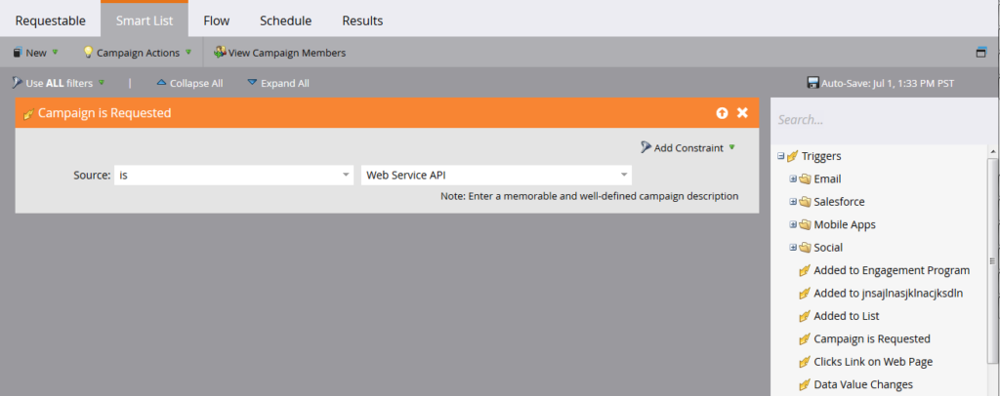
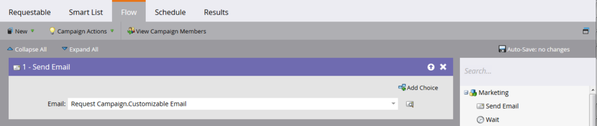
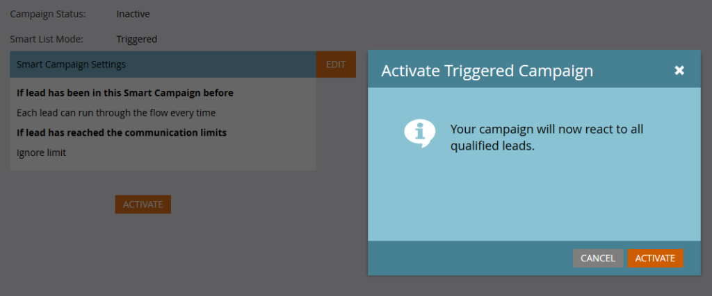

# Transactional Email

A common use case for the Marketo API is to trigger the sending of transactional emails to specific records via the [Request Campaign](https://developer.adobe.com/marketo-apis/api/mapi/#tag/Campaigns/operation/triggerCampaignUsingPOST) API call. There are a few configuration requirements within Marketo to execute the required call with the Marketo REST API.

- The recipient must have a record within Marketo
- There must be a Transactional Email created and approved in your Marketo instance.
- There must be an active trigger campaign with the "Campaign is Requested, 1. Source: Web Service API", that is set up to send the email

First [create and approve your email](https://experienceleague.adobe.com/docs/marketo/using/home.html). If the email is truly transactional, you will likely must set it to operational, but be sure that it legally qualifies as operational. This is configured from with the Edit Screen under Email Actions > Email Settings:


Approve it and we're ready to create our campaign:


If you're new to creating campaigns, check out the [Create a New Smart Campaign](https://experienceleague.adobe.com/docs/marketo/using/product-docs/core-marketo-concepts/smart-campaigns/creating-a-smart-campaign/create-a-new-smart-campaign.html) article. Once you've created your campaign, we must go through these steps. Configure your Smart List with the Campaign is Requested trigger:



Now we must configure the flow to point a Send Email step to our email:



Before activation, you must decide on some settings in the Schedule tab. If this particular email should only ever be sent once to a given record, then leave the qualification settings as is. If it's required that they receive the email multiple times, though, you want to adjust this to either every time or to one of the available cadences:

Now we're ready to activate:



## Sending the API Calls

**Note:** In the Java examples below, we are using the [minimal-json package](https://github.com/ralfstx/minimal-json) to handle JSON representations in our code.

The first part of sending a transactional email through the API is ensuring that a record with the corresponding email address exists in your Marketo instance and that we have access to its lead ID. For the purposes of this post, we assume that the email addresses are in Marketo already, and we only must retrieve the ID of the record. For this, we are using the [Get Leads by Filter Type](https://developer.adobe.com/marketo-apis/api/mapi/#tag/Leads/operation/getLeadsByFilterUsingGET) call. Let's look at our Main method for to request the campaign:

```java
package dev.marketo.blog_request_campaign;

import com.eclipsesource.json.JsonArray;

public class App
{
    public static void main( String[] args )
    {
        //Create an instance of Auth so that we can authenticate with our Marketo instance
        Leads leadsRequest = new Leads(auth).setFilterType("email").addFilterValue("requestCampaign.test@marketo.com");

        //Create and parameterize an instance of Leads
        //Set your email filterValue appropriately
        Leads leadsRequest = new Leads(auth).setFilterType("email").addFilterValue("test.requestCamapign@example.com");

        //Get the inner results array of the response
        JsonArray leadsResult = leadsRequest.getData().get("result").asArray();

        //Get the id of the record indexed at 0
        int lead = leadsResult.get(0).asObject().get("id").asInt();

        //Set the ID of your campaign from Marketo
        int campaignId = 0;
        RequestCampaign rc = new RequestCampaign(auth, campaignId).addLead(lead);

        //Send the request to Marketo
        rc.postData();
    }
}
```

To get to these results from the JsonObject response of leadsRequest, we must write some code . To retrieve the first result in the Array, we must extract the Array from the JsonObject and get the object indexed at 0:

```java
JsonArray leadsResult = leadsRequest.getData().get("result").asArray();
int leadId = leadsResult.get(0).asObject().get("id").asInt();
```

From here now all we must do is the Request Campaign call. For this, the required parameters are ID in the URL of the request, and an array of JSON objects containing one member, "id." Let's look at the code for this:

```java
package dev.marketo.blog_request_campaign;
import java.io.IOException;
import java.io.InputStream;
import java.io.InputStreamReader;
import java.io.OutputStreamWriter;
import java.io.Reader;
import java.net.MalformedURLException;
import java.net.URL;
import java.util.ArrayList;
import javax.net.ssl.HttpsURLConnection;
import com.eclipsesource.json.JsonArray;
import com.eclipsesource.json.JsonObject;

public class RequestCampaign {
    private String endpoint;
    private Auth auth;
    public ArrayList leads = new ArrayList();
    public ArrayList tokens = new ArrayList();

    public RequestCampaign(Auth auth, int campaignId) {
        this.auth = auth;
        this.endpoint = this.auth.marketoInstance + "/rest/v1/campaigns/" + campaignId + "/trigger.json";
    }
    public RequestCampaign setLeads(ArrayList leads) {
        this.leads = leads;
        return this;
    }
    public RequestCampaign addLead(int lead){
        leads.add(lead);
        return this;
    }
    public RequestCampaign setTokens(ArrayList tokens) {
        this.tokens = tokens;
        return this;
    }
    public RequestCampaign addToken(String tokenKey, String val){
        JsonObject jo = new JsonObject().add("name", tokenKey);
        jo.add("value", val);
        tokens.add(jo);
        return this;
    }
    public JsonObject postData(){
        JsonObject result = null;
        try {
            JsonObject requestBody = buildRequest(); //builds the Json Request Body
            System.out.println("Executing RequestCampaign call\n" + "Endpoint: " + endpoint + "\nRequest Body:\n"  + requestBody);
            URL url = new URL(endpoint);
            HttpsURLConnection urlConn = (HttpsURLConnection) url.openConnection(); //Return a URL connection and cast to HttpsURLConnection
            urlConn.setRequestMethod("POST");
            urlConn.setRequestProperty("Content-type", "application/json");
            urlConn.setRequestProperty("accept", "text/json");
            urlConn.setDoOutput(true);
            OutputStreamWriter wr = new OutputStreamWriter(urlConn.getOutputStream());
            wr.write(requestBody.toString());
            wr.flush();
            InputStream inStream = urlConn.getInputStream(); //get the inputStream from the URL connection
            Reader reader = new InputStreamReader(inStream);
            result = JsonObject.readFrom(reader); //Read from the stream into a JsonObject
            System.out.println("Result:\n" + result);
        } catch (MalformedURLException e) {
            e.printStackTrace();
        } catch (IOException e) {
            e.printStackTrace();
        }
        return result;
    }

    private JsonObject buildRequest(){
        JsonObject requestBody = new JsonObject(); //Create a new JsonObject for the Request Body
        JsonObject input = new JsonObject();
        JsonArray leadsArray = new JsonArray();
        for (int lead : leads) {
            JsonObject jo = new JsonObject().add("id", lead);
            leadsArray.add(jo);
        }
        input.add("leads", leadsArray);
        JsonArray tokensArray = new JsonArray();
        for (JsonObject jo : tokens) {
            tokensArray.add(jo);
        }
        input.add("tokens", tokensArray);
        requestBody.add("input", input);
        return requestBody;
    }

}
```

This class has one constructor taking an Auth, and the Id of the campaign. Leads are added to the object either by passing an `ArrayList<Integer>` containing the Ids of the records to setLeads, or by using addLead, which takes one integer and appends it to the existing ArrayList in the leads property. To trigger the API call to pass the lead records to the campaign, postData must be called, which returns a JsonObject containing the response data from the request. When request campaign is called, every lead passed to the call will be processed by the target trigger campaign in Marketo and be sent the email which was created previously. Congratulations, you've triggered an email through the Marketo REST API. Keep an eye out for Part 2 where we look at dynamically customizing the content of an email through Request Campaign.

### Building your Email

To customize our content, first we must configure a [program](https://experienceleague.adobe.com/docs/marketo/using/product-docs/core-marketo-concepts/programs/creating-programs/create-a-program.html) and an [email](https://experienceleague.adobe.com/docs/marketo/using/home.html) in Marketo. To generate our custom content, we must create tokens inside the program, and then place them into the email that we're going to be sending. For simplicity's sake, we are using just one token in this example, but you can replace any number of tokens in an email, in the From Email, From Name, Reply-to, or any piece of content in the email. So let's create one token Rich Text for replacement and call it "bodyReplacement". Rich Text allows us to replace any content in the token with arbitrary HTML that we want to input.


Tokens can't be saved while empty, so go ahead and insert some placeholder text here. Now we must insert our token into the email:


This token will now be accessible for replacement through a Request Campaign call. This token can be as simple as a single line of text which must be replaced on a per-email basis, or can include almost the entire layout of the email.

### The Code

```java
package dev.marketo.blog_request_campaign;

import com.eclipsesource.json.JsonArray;

public class App
{
    public static void main( String[] args )
    {
        //Create an instance of Auth so that we can authenticate with our Marketo instance
        Auth auth = new Auth("Client ID - CHANGE ME", "Client Secret - CHANGE ME", "Host - CHANGE ME");

        //Create and parameterize an instance of Leads
        Leads leadsRequest = new Leads(auth).setFilterType("email").addFilterValue("requestCampaign.test@marketo.com");

        //get the inner results array of the response
        JsonArray leadsResult = leadsRequest.getData().get("result").asArray();

        //get the id of the record indexed at 0
        int lead = leadsResult.get(0).asObject().get("id").asInt();

        //Set the ID of our campaign from Marketo
        int campaignId = 1578;
        RequestCampaign rc = new RequestCampaign(auth, campaignId).addLead(lead);

        //Create the content of the token here, and add it to the request
        String bodyReplacement = "<div class=\"replacedContent\"><p>This content has been replaced</p></div>";
        rc.addToken("{{my.bodyReplacement}}", bodyReplacement);
        rc.postData();
    }
}
```

If the code looks familiar, that's because it only has two additional lines from the main method above. This time we're creating the content of our token in the bodyReplacement variable and then using the addToken method to add it to the request. addToken takes a key and a value and then creates a JsonObject representation and adds it to the internal tokens array. This is then serialized during the postData method and creates a body that looks like this:

```json
{
    "input":
    {
        "leads": [
            {
                "id": 1
            }
        ],
        "tokens": [
            {
                "name": "{{my.bodyReplacement}}",
                "value": "<div class=\"replacedContent\"><p>This content has been replaced</p></div>"
            }
        ]
    }
}
```

Combined, our console output looks like this:

```bash
Token is empty or expired. Trying new authentication
Trying to authenticate with ...
Got Authentication Response: {"access_token":"19d51b9a-ff60-4222-bbd5-be8b206f1d40:st","token_type":"bearer","expires_in":3565,"scope":"apiuser@mktosupport.com"}
Executing RequestCampaign call
Endpoint: .../rest/v1/campaigns/1578/trigger.json
Request Body:
{"input":{"leads":[{"id":1}],"tokens":[{"name":"{{my.bodyReplacement}}","value":"<div class=\"replacedContent\"><p>This content has been replaced</p></div>"}]}}
Result:
{"requestId":"1e8d#14eadc5143d","result":[{"id":1578}],"success":true}
```

## Wrapping Up

This method is extensible in a multitude of ways, changing content in emails within individual layout sections, or outside emails, allowing custom values to be passed into tasks or interesting moments. Anywhere a token can be used from within a program can be customized using this method. Similar functionality is also available with the [Schedule Campaign](https://developer.adobe.com/marketo-apis/api/mapi/#tag/Campaigns/operation/scheduleCampaignUsingPOST) call which will allow you to process tokens across an entire batch campaign. These can't be customized on a per lead basis, but are useful for customizing content across a wide set of leads.
