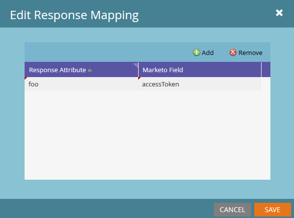

# Response Mappings

Marketo can translate data received by a Webhook from two content types and return these values back to a lead field: JSON and XML. The Marketo Field parameter will always use the [SOAP API name](../rest-api/fields.md) of the field. Each Webhook may have an unlimited number of response mappings, which are added and edited by clicking the [!UICONTROL Edit] button in the Response Mappings pane of your Webhook:


Response Mappings are created via a pairing of a "Response Attribute", the path to the desired property in the XML or JSON document, and the "Marketo Field", which specifies the Lead field which has the value written to it from the Response Attribute.

Keys for properties must consist of alphanumeric characters, dash (-), underscore(_), colon (:), and whitespace to be accessed via Marketo response mappings.

## JSON Mappings

JSON properties are accessed with dot-notation, and array notation. Array notation in Marketo will not accept strings as input, and will only accept integers. To retrieve data from a JSON document, the response type must be set to JSON:

```json
{ "foo":"bar"}
```

To access the `foo` property in a response mapping, use the `name` of the property since it is in the first level of the JSON object, `foo`. Here's what that looks like in Marketo:



Here's a more complicated example with an array:

```json
{
    "profileId" : 1234,
    "firstName" : "Jane",
    "lastName" : "Doe",
    "orders" : [
        {
            "orderId" : 5678,
            "orderDate" : "2015-01-01",
            "orderProductId" : "4982"
        },
        {
            "orderId" : 5678,
            "orderDate" : "2014-05-07",
            "orderProductId" : "4982"
        }
    ]
}
```

We want to access the orderDate from the first element of the orders array. To access this property, use the following: `orders[0].orderDate`

## XML Mappings

Values can be accessed from individual elements in XML documents. This uses dot notation similar to the JSON mappings. Let's look at this simple example:

```xml
<?xml version="1.0" encoding="UTF-8"?>
<example>
    <foo>bar</foo>
</example>
```

To access the foo property here, use the following: `example.foo`

The example element must first be referenced before accessing `foo`. To access a property, all elements in the hierarchy must be referenced in the mapping. XML documents with arrays are a bit more complicated. Use the following example:

```xml
<?xml version="1.0" encoding="UTF-8"?>
<elementList>
    <element>
        <foo>baz</foo>
    </element>
    <element>
        <foo>bar</foo>
    </element>
    <element>
        <foo>bar</foo>
    </element>
</elementList>
```

The document consists of the parent array `elementList`, with children, element that contains one property: `foo`. For the purposes of Marketo response mappings, the array is referenced as `elementList.element`, so the children of the elementList are accessed via `elementList.element[i]`. To get the value of foo from the first child of elementList, we use this response attribute: `elementList.element[0].foo` This returns the value "baz" to our designated field. Trying to access properties inside elements which contain both unique and non-unique element names result in undefined behavior. Each element must be a single property or an array, the types cannot be intermixed.

## Types

When mapping attributes to fields, you must ensure that the type in your webhook response is compatible with the target field. For example, if the value in the response is a string, and the selected field is of the type integer, then the value is not written. Read about [Field Types](../rest-api/field-types.md).
